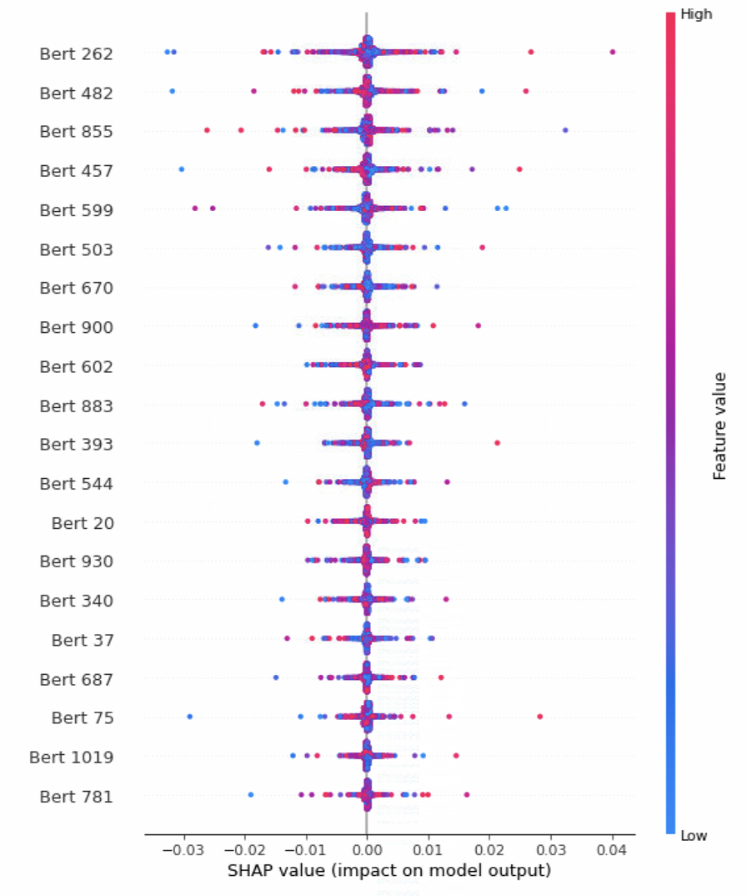
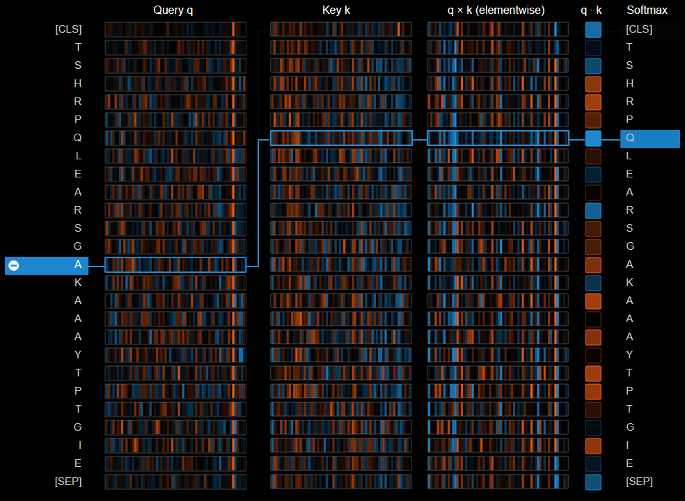

# Characterization and interpretation for nucleic-acid-binding residues from sequence information using SOFB  
This repository is developed for nucleic acid binding residues identification using SOFB, which implemented an ensemble deep learning model-based sequence network.  

# Requirement  
SOFB is developed under Linux environment with:  
python  3.8.0
transformers  4.8.2  
torch  1.8.1  
tensorflow  2.7.0  
sentencepiece 0.1.96  
protobuf  3.19.1

# Bioinformatics tools and database   
To run the SOFB, you need to install the bioinformatics tools and download the corresponding databases:  
(1) Install blast+ for extracting PSSM(position-specific scoring matrix) profiles  
To install ncbi-blast-2.8.1+ and download NR database (ftp://ftp.ncbi.nlm.nih.gov/blast/db/) for psiblast, please refer to BLAST(https://www.ncbi.nlm.nih.gov/books/NBK52640/).  
(2) Install HHblits for extracting HMM profiles
To install HHblits and download uniclust30_2018_08 (http://wwwuser.gwdg.de/~compbiol/uniclust/2018_08/uniclust30_2018_08_hhsuite.tar.gz) for HHblits, please refer to https://github.com/soedinglab/hh-suite.


# Extract multi-features using various method  
For the PKs, Physicochemical characteristics and RAA in DNA and RNA, you can generate different results by changing the datasets path in the file :  
```
python Pks.py 
python RAA.py 
python pychar.py 
```
For the other features, you can get them by run the command, particularly, the model used for generating dynamic embedding is provided in fighsare(https://figshare.com/articles/dataset/SOFB/22256359), you need download it and set the path in the program :  
```
python generate_multi_feature.py --nucleic_acid RNA(or DNA)
```
# Prediction and test 
After getting the all data_vec(train_gen, train_bio_vec, train_dyna), you can train a new model or make the test by the command:  
```
python predict.py --nucleic_acid RNA --epochs 30 --batchsize 1024 --ensemble 4
```

# Interpretability  and Visization
The interpretability analysis of our model refers to the shap(https://github.com/slundberg/shap) and the Visualization refers t othe Prottrans(https://github.com/agemagician/ProtTrans).
<p align="center">
  
  <b>intepretability of the SOFB</b><br><br>
</p>

<p align="center">
  
  <b>visualization of the bio-language learning model</b><br><br>
</p>
